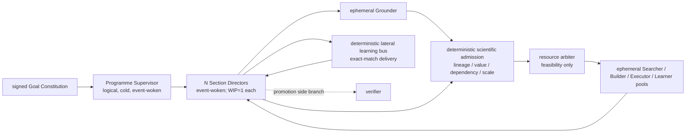

# Research-control runtime architecture

> **Goal:** Pursue the functional objective in the signed Goal Constitution while maximizing goal-aligned, current-grounded/nonduplicate, minimally discriminating, measurement-valid, receipt-linked LEARN commits per wall-clock hour. Run one independent event-driven candidate lifecycle per section, propagate committed learning laterally, and keep Programme Supervisor, verifier, and global wave joins off the reversible hot path.

## Decision and present status

**Architecture selected.** The repository contains deterministic V0 trace and programme-flow
checkers, plus deterministic lateral-learning schemas. It does **not** activate a live durable
engine, provider, hook, broker runtime, or scientific run. As of 2026-08-04, scientific
SEARCH=0 and LEARN=0. This is an architecture and local checking floor, not a complete system.

## Functional objective, operational North Star, and exclusions

The human-signed Goal Constitution owns the functional objective, success observable,
comparator/horizon/scaling regime, invariants, method freedoms, forbidden proxies, and amendment
authority. The runtime cannot replace or silently amend it.

The operational measure is goal-aligned, current-grounded/nonduplicate, minimally discriminating,
measurement-valid terminal SEARCH receipts per wall-clock hour and exact receipt-linked LEARN
commits per wall-clock hour; LEARN is the closed-loop priority and SEARCH its leading measure. A
discriminating null, falsification, negative, or KILL receipt counts on the same basis as a positive
receipt. A measurement-invalid receipt may support instrumentation repair but earns no scientific
credit. Agents, proposals, documents, tokens, jobs, sweep points, verifier calls, smoke checks,
instrumentation checks, and resource utilization are control or diagnostic activity, not SEARCH or
LEARN.

Useful throughput is multiplicative. Offered candidate cycles matter only after goal alignment,
current grounding/nonduplication, discriminability, measurement validity, and timely receipt
consumption all pass. Spare compute cannot compensate for a failed semantic yield term.

## Logical topology

The diagram has one *logical* Programme Supervisor, not one resident process. It has no Supervisor
in the lateral path. Pools are ephemeral workers; their provider session is not programme authority.
Grounder, Searcher, Builder, Executor, Learner, and Director use immutable, role-distinct grants.
The resource arbiter runs only after scientific admission and proves feasibility only; it cannot
create scientific value or release a dependency.

## Candidate streaming contract

Each section owns this local chain:

`current grounding -> candidate/known-result disposition -> value/dependency admission -> minimal build -> prospective intent -> validity-bearing receipt -> learner proposal -> Director COMMIT -> next candidate or receipt-linked scale release`.

The section has one live candidate/test (WIP=1). Completion of candidate A enqueues only A's
next eligible transition; it never waits for B..N. A DAG is not the defect: global fan-in or
barrier edges are. Therefore `WAIT_FOR_OTHER_SECTION`, a wave, all-design, all-recipient,
Supervisor-review, and model-verification waits are invalid on this loop. Ready work drains in
local priority: Director commit, learning, execution, build, then search.

An exact blocker closes or pauses the lease and earns neither measure. A fixed parameter/seed sweep
is execution, not adaptive search. An escalated confirmation, full sweep, scale run, or port requires
a prior measurement-valid minimal receipt and Director release. A verifier can affect only promotion;
a timeout becomes pending verification and does not block a valid local cycle.

## Semantic admission and cancellation

Before candidate generation or build, the Section exact-joins:

`Goal Constitution -> Programme Snapshot -> OPEN_ISSUE -> SECTION_MANDATE -> SECTION_CHARTER -> current GROUNDING_PACKET`.

The grounding packet carries a query denominator, canonical/alternate/retraction coverage, known
results, frontier gap, revision/fence, and grounder provenance. A known result is either rejected as
novel or registered explicitly as replication. An unauthorized objective/axis change fails; idle
capacity never supplies missing authority.

Every admitted job declares its authority revision/fence, scientific dependencies, value class, and
run scale. It also exact-joins a current per-section Goal/Grounding authority row by Grounding Packet
digest, revision, and fence plus either a grounded-search authorization or a Section-admission
authorization. This join is checked before resource capacity. An unresolved upstream invalidator
holds dominated downstream work. A new authority or grounding revision fences queued work and
prevents a late stale result from mutating current state. This is a local information dependency,
not a global programme barrier.

The executable specification freezes estimand, comparator, positive and negative controls, validity
checks, and a measurement-contract digest. A terminal receipt closes the intent structurally, but only
`measurementValidity=PASS` earns scientific SEARCH or supports scientific LEARN. `FAIL|UNKNOWN` routes
to separately counted instrumentation repair.

## Hot state and authority

The hot state is one typed durable event log with queues, leases/deadlines, authority/grounding
revisions, dependency releases, cancellation fences, wake and subscription cursors, and
replay/idempotency fences. An always-hot LLM is not hot state. One logical semantic
authority does not imply one resident process or one sequential parent workflow. Documents are
durable evidence; repository search is discovery and recovery, never delivery, waking, or
catch-up. There must be no dual authoritative event stores.

The Programme Supervisor is cold, event-woken, and portfolio-only: it admits pull bids and
consumes declassified aggregate signals. It does not schedule, interpret, or commit a live
section. Directors alone admit locally, issue intents, release scale, and commit section state;
immutable separate Grounder, Searcher, Builder, Executor, and Learner instances respectively
ground, propose, specify, observe receipts, and propose learning.

## Lateral committed-learning path

The only cross-section semantic path is:

`receipt -> learner proposal -> source Director COMMIT -> packet -> exact-match delivery -> recipient Director ADOPT|REJECT|DEFER -> separate local transfer commit`.

The source publishes only a receipt-grounded, committed delta. Human method proposals stay
section-local. The deterministic bus performs exact subscription matching only: it does not
interpret applicability or decide state. Source and recipients never wait for acknowledgement,
quorum, all recipients, the Supervisor, or a verifier. Fan-out, replay, delivery, admission, and
transfer commit are propagation metrics and add no SEARCH or LEARN credit.

## Verification and promotion boundary

| Tier | Purpose | Hot-path effect |
|---|---|---|
| V0 | Deterministically check schema, digest, Goal/grounding lineage, known-result disposition, roles, dependencies, scale release, measurement validity, revisions, fences, visibility, and replay. | Atomic rejection; no model call. |
| V1 | Run reversible local candidates under Director rules and executor receipts. | Continues without a verifier. |
| V2 | Independently review declassified, promotion-eligible load-bearing empirical claims lacking a machine oracle. | Stops promotion only. |
| V3 | Review broad retirement/close, public achievement, irreversible allocation, or safety-critical transition against frozen criteria. | Stops enactment or publication only. |

The deterministic broker is an infrastructure overlay, not an agent or semantic owner. Haiku,
Luna, and evaluator models are advisory V2/V3 promotion-side inputs only; they are never
authority or hot-path verifiers. OpenTelemetry, OpenInference, and Phoenix are observation and
postmortem consumers only.

## Component dispositions

| Component | Decision |
|---|---|
| [Claude Agent SDK](https://code.claude.com/docs/en/agent-sdk/overview) and [Codex SDK](https://learn.chatgpt.com/docs/codex-sdk) | Provider/session adapters; not programme authority or durable scheduler. |
| [Claude Managed Agents](https://platform.claude.com/docs/en/managed-agents/overview) | Useful beta, Claude-only managed hosting for long-running, stateful, scheduled worker sessions and persistent environments. It may host a Claude bearer pool, but is not the cross-provider research authority, exact learning-bus broker, or common durable spine for Claude and Codex. |
| [Claude Code Agent Teams](https://code.claude.com/docs/en/agent-teams) | Optional ephemeral bearer-pool/shared-task/mailbox surface; not durable authority. Its official documentation calls it experimental and identifies session-resumption, task-status/coordination, and shutdown limitations. |
| MCP | Connection protocol only. |
| Goal Kernel | Keep immutable human-goal and provider-edge semantics before the pilot. If a durable engine is adopted, migrate generic run/event/lock/postmortem state into the single chosen spine and retire duplicate storage—never peer dual-write. |
| [DBOS TypeScript/Postgres queues](https://docs.dbos.dev/typescript/tutorials/queue-tutorial) and [messaging](https://docs.dbos.dev/typescript/tutorials/workflow-communication) | First synthetic falsifying pilot: queues expose per-worker/global concurrency and durable messaging/idempotency without replacing native agent loops. Not adopted yet. |
| [Temporal task queues](https://docs.temporal.io/task-queue), [workflows](https://docs.temporal.io/workflows), and [signals](https://docs.temporal.io/develop/typescript/workflows/message-passing) | Fallback if DBOS fails for evidenced engine reasons; heavier. |
| [Restate services](https://docs.restate.dev/foundations/services) and [service communication](https://docs.restate.dev/develop/ts/service-communication) | Keyed-state alternative; avoid a single exclusive Supervisor key. |
| [Mastra workflows](https://mastra.ai/ai-workflows) and [snapshots](https://mastra.ai/en/reference/workflows/snapshots) | Useful agent/workflow API and optional candidate-local wrapper, but not the first durable spine. `.parallel()` or all-output continuation can recreate fan-in, and production durability may add another engine. Use only after it passes the identical candidate-streaming contract, not because it is TypeScript. |
| [LangGraph/Pregel](https://docs.langchain.com/oss/python/langgraph/pregel) | Reject as programme hot spine: documented BSP supersteps wait for selected actors and defer channel visibility. It may run inside one local worker. |
| Execution runtime/spine | After adoption use exactly one. |

## DBOS synthetic pilot: semantic prerequisite and falsification gates

The engine pilot is postponed until deterministic hostile fixtures prove Goal/grounding lineage,
known-result rejection, measurement-valid scientific credit, dependency dominance, scale release,
and stale-work fencing. Otherwise DBOS would durably retry an under-specified loop.

The first pilot passes only if all of these are demonstrated with synthetic, non-scientific
fixtures:

1. A closes build -> receipt -> learn -> transfer while B--F remain upstream.
2. Two recipients progress independently from exact-match delivery.
3. Crash/restart produces no duplicate scientific counts.
4. CPU and GPU queues retain independent capacity and backpressure.
5. Verifier timeout cannot block the local cycle.
6. Cancellation and process fencing permit no descendant or double-paid attempt.
7. Reported metrics are exact.

Failure means evaluate Temporal, then Restate, for evidenced engine reasons—not custom
durability.

## Adoption boundary

The thin custom research adapter owns domain schemas, exact joins, scheduling priority,
visibility, propagation, resource mapping, and metrics. The adopted engine owns persistence,
delivery, timers, recovery, and operational history. This boundary forbids building a new generic
durable engine.

## Limits and next evidence

V0 is local self-checking, not live-system acceptance. Its deterministic hostile semantic floor
passed on 2026-08-04 as part of the 180-test combined repository run. No live engine selection,
durability, provider integration, hook enforcement, broker operation, resource-pilot result, or
scientific receipt/commit is verified here. The next engine evidence is the synthetic DBOS pilot
against the gates above. Only that pilot can select or reject an execution spine; no custom generic
durable engine is authorized.
