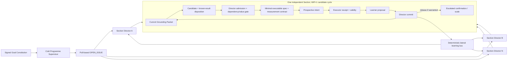

# Search-and-learn throughput postmortem

> **Disposition:** CONTROL-PLANE FAILURE / REFORGE REQUIRED
>
> **Scope:** four user-supplied, bounded transcripts plus the current local skill and V0 checker surfaces.
>
> **Causal limit:** the transcripts are not a complete terminal run denominator. They support the observed failure chain below, but not an exact causal percentage or a complete historical audit.
>
> **Durable evidence boundary:** [`evidence/INCIDENT-EVIDENCE-2026-08-04.md`](evidence/INCIDENT-EVIDENCE-2026-08-04.md) preserves the admitted observations, exact raw hashes, and bounded excerpts. The raw attachments remain local and are not fresh-clone reproducible.

## Executive verdict

The research harness scaled offered work, not useful learning.

It could create candidates, workflows, jobs, sweeps, verification attempts, and resource reservations. It could not deterministically require that each dispatched job was:

1. joined to the current signed functional objective;
2. grounded against current canonical and retracted results;
3. non-duplicate or an explicitly registered replication;
4. the cheapest discriminator not dominated by an unresolved upstream result;
5. a minimal existence test before scale, porting, or sweeping;
6. measured under a frozen validity contract; and
7. consumed into a receipt-linked change of the next bet.

The result was predictable: more agents and more GPU work multiplied low-yield activity. In the latest transcript, the agent itself reports roughly twelve hours and eight million tokens with zero goal-direct measurements, seven hand-designed structures killed, six rediscoveries, twelve arms on one GPU, and three confounded measurements. Those figures are transcript admissions, not independently metered totals, but the zero-direct-measurement sequence is visible in the supplied episode.

This is a structural defect in the skill/harness design. It is not repaired by asking the same model to remember the Bitter Lesson more forcefully.

## Evidence boundary

| Packet | Bounded observation | What it establishes | What it does not establish |
|---|---|---|---|
| `f53ffa73…` (`sha256:f419281d…`) | Four construction-before-search rediscoveries; late repository evidence reverses local theories; a 42-minute evidence arm; three negative readings later become measurement-invalid or confounded; after naming the failure, the process builds a 392-line workflow and launches ten more arms. | Written recognition did not change runtime admission. Evidence and measurement validity arrived too late. | Complete run counts or the scientific truth of the proposed mechanism. |
| `0b98ef1e…` (`sha256:51d8c7fb…`) | The human repeatedly restates the belief, target, and invariants; the agent reports six frame shifts and six rediscoveries, never read frozen success criteria, found five strawmen, built no proof-of-concept, and repeatedly asks the human to choose tactics. | The human was the effective Programme Supervisor and Section Director; cold prose did not compile into autonomous decisions. | A complete denominator for every job that day. |
| `4996ff2d…` (`sha256:9be1220a…`) | A4 is named as an upstream result able to invalidate A1–A3; A5/A6 are named as authority-requiring axis changes; A1–A5 still launch together. Idle resources then motivate seven longer jobs, including four GPU jobs and full multi-seed sweeps. | Dependency dominance and goal authority were not enforced. Resource utilization became a dispatch proxy. | That every launched job was scientifically worthless. |
| `ed10a43b…` (`sha256:b44ece66…`) | Fixed sweeps are admitted to have been called search; no machine changes its bet from accumulated evidence; the belief-claimed local-rule learner is never trained once; slope, GPU porting, component joins, capacity, and energy work precede the one-point existence test. | Execution was misclassified as search, and scale work was admitted before the scientific object existed. | That the later proposed one-point machine would succeed. |

The durable declassified source packet is
[`evidence/INCIDENT-EVIDENCE-2026-08-04.md`](evidence/INCIDENT-EVIDENCE-2026-08-04.md). It records the
local raw locators and hashes, but deliberately does not pretend that a fresh clone contains the raw
transcripts or independently metered totals.

## The accounting error

Activity, execution, search, and learning are different events.

| Event | Required observable | Scientific credit |
|---|---|---|
| Activity | agent, document, token, job, tool call, verifier call | none |
| Execution | a parameter/seed point runs and terminates | none by itself |
| SEARCH | a prospective intent receives a measurement-valid terminal receipt from a goal-aligned, current-grounded, discriminating test | one SEARCH receipt |
| Adaptive search | a receipt changes the next candidate, allocation, scale, or stop decision | SEARCH plus a visible policy update |
| LEARN | a distinct learner consumes that receipt and a distinct Director commits a belief/decision delta | one LEARN commit |
| Instrument repair | a failed/unknown measurement-validity receipt changes the instrument or protocol | repair credit only; no scientific SEARCH or LEARN |

A fixed sweep is execution. Later points do not use earlier points to change where to look, so the sweep is not adaptive search. Parallel execution becomes search only when receipt-driven selection, allocation, pruning, or stopping changes subsequent work.

## Throughput model

Raw concurrency controls only the offered-work term. Useful scientific throughput is multiplicative:

```text
useful LEARN/hour
  = offered candidate-cycles/hour
  × P(goal-aligned)
  × P(current-grounded and nonduplicate)
  × P(minimally discriminating)
  × P(measurement-valid)
  × P(receipt consumed and committed before stale)
```

If any yield term is near zero, more concurrency produces more waste. This explains why low GPU utilization and low scientific throughput can coexist without spare GPU being the remedy. Unused capacity is correct when no scientifically admissible work is ready.

The operational North Star is therefore:

> Maximize goal-aligned, current-grounded/nonduplicate, minimally discriminating, measurement-valid, receipt-linked scientific LEARN commits per wall-clock hour.

SEARCH receipts/hour is a leading measure. It must not be increased by leaving receipts unconsumed, splitting one observation into many packets, or running fixed sweeps that never alter the next bet.

## Structural failure chain

### 1. The goal existed as prose, not an executable constitution

Belief, functional objective, success observable, invariants, permitted method freedom, human suggestions, scaling regime, and amendment authority were mixed together. The agent could quote the belief while dispatching work that touched none of its elements.

Consequence: the human repeatedly had to restate what the programme was for and ask how a proposed job connected to it.

Repair: a signer-owned `GOAL_CONSTITUTION` must assign stable IDs to the objective, success observable, comparator/horizon/scaling regime, invariants, forbidden proxy metrics, method freedom, and amendment authority. A belief is explicitly a prior, never evidence. The Supervisor may validate and carry this artifact; it may not author or silently amend it.

### 2. Grounding was advisory and model-side

The orchestration skill already said to search before claiming novelty or building. The Section admission wire did not require a current grounding artifact. The same model could name “construction before search” and immediately construct again.

Consequence: known results and existing mechanisms were rediscovered; canonical evidence arrived tens of minutes later and reversed the active theory.

Repair: candidate admission must exact-join a current `GROUNDING_PACKET` carrying its query denominator, canonical/alternate/retraction coverage, known-result set, frontier gap, revision/fence, and an immutable grounder grant. `NOVEL_GAP` and `REGISTERED_REPLICATION` are explicit dispositions. A known result cannot enter as novel.

### 3. The dependency graph lacked scientific dominance edges

A4 could invalidate A1–A3, yet all ran together. This is not “massive parallelism”; it is parallel execution of work whose value depends on an unresolved predecessor.

Consequence: dominated work consumed compute and returned stale results.

Repair: every job declares exact dependencies. A cheap upstream invalidator or existence test holds dominated build, port, sweep, and confirmation work. Its terminal receipt may release, revise, or kill them. A new authority revision/fence invalidates queued work and prevents late results from mutating current state.

### 4. Resource feasibility was mistaken for scientific admission

The resource layer correctly asks whether a job fits CPU/RAM/VRAM limits. It did not require proof that the job deserved to exist. Idle GPU became a reason to generate and lengthen work.

Consequence: utilization became the local objective, even though it is absent from the signed scientific goal.

Repair: scientific admission precedes resource admission. A resource envelope proves only feasibility. Free capacity cannot create a candidate, authorize an axis change, release a sweep, or override a dependency. `candidateComputeUtilization` remains diagnostic only.

### 5. Scale preceded existence

The harness admitted slope measurement, GPU porting, component interfaces, and full sweeps before one local-rule-only learner had produced a single held-out observation.

Consequence: the system attempted to measure scaling of a scientific object that did not exist.

Repair: enforce a scale ladder:

```text
minimal existence/discriminator
  -> measurement-valid receipt
  -> learner proposal
  -> Director commit/release
  -> escalated confirmation or scale sweep
```

An escalated run without the prior receipt-linked release is `SWEEP_WITHOUT_RELEASE` and does not dispatch. G0 remains a goal-level eligibility condition for the eventual mechanism, not a reason to skip the cheapest existence observation.

### 6. Measurement validity was not part of scientific credit

Three negative mechanism readings were later identified as measurement-invalid or instrumentation-confounded. The current trace could still count a structurally valid terminal receipt as SEARCH and let it support LEARN.

Consequence: instrument failure could propagate as scientific learning.

Repair: the executable specification freezes estimand, comparator, controls, validity checks, and a measurement-contract digest. A receipt declares `PASS | FAIL | UNKNOWN` with validity evidence. Only `PASS` can earn scientific SEARCH or support scientific LEARN. `FAIL/UNKNOWN` can enter an `INSTRUMENTATION_REPAIR` chain, which is visible but credited separately.

### 7. The human occupied both missing authority roles

The agent repeatedly asked which tactical action to take after the user had already delegated the programme. The user had to reconnect every proposal to the belief and point out that sweeps were not search.

Consequence: the nominal Supervisor and Director were cold documents; the human was the actual hot control loop.

Repair: routine decisions become artifact/event driven. One logical Programme Supervisor remains cold and event-woken. Multiple Section Directors pull published issues and own local admission/intent/commit. They do not wait for human tactical selection. Human intervention is reserved for Goal Constitution amendment, governance, safety/resource authority, and other explicitly signed choices.

### 8. Verification and batch workflows added latency without improving yield

Long evidence arms returned only at their end; model verifier timeouts and batch fan-in delayed learning. Verification was sometimes attempted after a no-build pipeline, so it could not explain the already-zero scientific denominator.

Consequence: findings arrived stale, and verifier cost sat on or near the critical path.

Repair: V0 deterministic gates run per packet. V1 reversible local work has no model verifier. V2/V3 review blocks promotion or enactment only. Grounding and observations stream partial receipt-addressed deltas; no global “all arms complete” barrier exists.

### 9. Documents and repository search were cold storage, not hot state

Canonical documents could preserve evidence, and search could rediscover it. Neither wakes a Director, advances a cursor, invalidates queued work, or ensures every candidate consumed the current snapshot.

Consequence: authoritative evidence existed without being on the action path.

Repair: documents remain semantic authority and durable evidence. A single typed event/queue layer carries revision/fence, wake, subscription, replay, and cancellation state. It stores locators and digests, not a second competing scientific truth.

## Responsibility topology

Responsibility separation is required where combining roles creates an authority or provenance conflict. It is not a universal rule that every small deterministic function needs a separate agent.

| Function | Bearer | May decide | Must not decide |
|---|---|---|---|
| Goal signing/amendment | authorised human/governance | objective, success observable, invariants, authority | section method or receipt interpretation |
| Programme supervision | one logical cold Supervisor | landscape, issue portfolio, pull mandates, programme decisions | live method, run, candidate, individual receipt |
| Section direction | many event-woken Directors | charter, local admission, prospective intent, local commit | programme objective or global disposition |
| Grounding | ephemeral Grounder | cited current snapshot and known-result disposition | novelty verdict authority or candidate admission |
| Search/build/execute/learn | ephemeral, immutable role grants | produce the role-specific packet | admit or commit its own output |
| Broker/scheduler/resource arbiter | deterministic runtime | exact joins, readiness, capacity, replay, fences | scientific relevance, novelty, interpretation |
| Verifier | promotion-side, risk-triggered | bounded review verdict | reversible local hot-path veto |

Searcher and learner are separated because candidate generation and evidence interpretation have different inputs, artifacts, and incentives. A provider process may be reused only after a context reset as a stateless bearer under a new immutable grant with no hidden authority carry-over; the artifacts and write sets remain distinct.

## Corrected streaming pipeline



Independent Sections stream concurrently. Within one Section, a cheap upstream invalidator may intentionally hold dominated work. This local dependency is information-efficient, not a programme-wide barrier.

## Durable-engine decision

A durable engine is eventually useful for persistence, queues, timers, crash recovery, wake delivery, replay, and cancellation. It cannot decide which work is scientifically valuable.

Therefore:

- do not build a new generic durable engine;
- do not adopt DBOS, Temporal, Restate, Mastra, or another runtime before the semantic hostile tests pass;
- retain the current thin deterministic research adapter as the owner of Goal/grounding/validity/dependency/scale semantics;
- after those semantics pass locally, pilot DBOS as the first replaceable persistence/execution spine;
- adopt exactly one spine and retire duplicate operational authority.

Without this order, durability makes the failure worse by reliably retrying stale or low-value work.

## Deterministic acceptance cases

The repair is not complete until the harness proves all of these without an LLM verifier:

1. A trace lacking Goal → Snapshot → Issue → Mandate → Charter → Grounding lineage fails.
2. A frozen known result cannot be admitted as a novel gap.
3. A stale grounding or authority revision/fence cannot dispatch or mutate current state.
4. An unauthorized objective/axis change fails even with idle resources.
5. A downstream job waits while its upstream invalidator is unresolved.
6. An escalated/full sweep without a prior measurement-valid minimal receipt and Director release fails.
7. A measurement `FAIL/UNKNOWN` cannot increment scientific SEARCH or support scientific LEARN.
8. Instrumentation repair remains visible but has a separate zero-science counter.
9. Free GPU capacity cannot turn a scientifically inadmissible job into ready work.
10. Independent Sections and lateral committed-learning delivery continue without Supervisor, verifier, or global fan-in.

Local V0 status on 2026-08-04: these cases are represented in the deterministic trace, flow, and
learning-bus fixtures. The combined repository command
`bun test agents/research-control agents/skills/directing-research/tests agents/skills/forging-skills/tests`
passed 180 tests with 460 expectations after formatting. This proves the local checker floor only.
It does not prove provider-hook enforcement, durable recovery, broker operation, or scientific output;
realized SEARCH and LEARN remain zero.

## Final responsibility statement

The skills encoded many of the right ideas, but left their decisive parts advisory. The harness enforced role names, hashes, resource bounds, and event order while omitting the semantic admission conditions that determine whether compute becomes learning. That mismatch is the design failure.

The remedy is not another exhortation, another batch of agents, or immediate durable-runtime work. It is to compile the signed goal, current knowledge, scientific value, dependency dominance, scale release, and measurement validity into the packet and scheduler boundaries that every job must cross.
