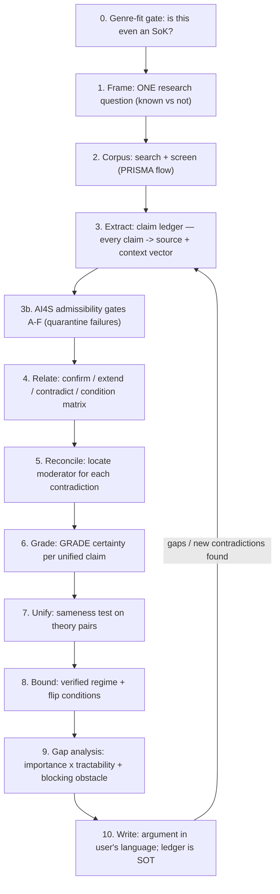

# SoK — Evidence Synthesis, Reconciliation, Taxonomy & Unification

> **Version**: v2606.2.0 (2026-06-18)
> **Scope**: Turn a corpus of papers/notes into ONE defensible, traceable position for a
> top-tier-science / AI4S researcher. Method-grounded (PRISMA 2020, Kitchenham SLR, Nickerson 2013,
> GRADE, Cochrane, REFORMS / Kapoor-Narayanan). This file holds the precedence-setting CORE inline;
> everything else lives in `references/` and loads on demand.
> **Out of scope** (delegate, do not duplicate): MECE local structure → `/MECE`; editorial narrative
> → `/REORG`; diagram/Mermaid choice → `/AA`; ruthless review → `/linus`; versioning /
> Single-Source-of-Truth / staleness / ledger↔doc sync → `grenza-doc-discipline` skill.
> **Corpus tooling**: the arxiv MCP (six tools: `search_papers`, `get_abstract`, `download_paper`,
> `read_paper`, `citation_graph`, `semantic_search`) — see `references/workflow.md`.
> **Build order (atomic).** This SKILL.md and its **7 reference targets** (genre, workflow, taxonomy,
> ledger, synthesis, ai4s-gates, writing) ship in ONE commit — no index pointer may dangle. Verify:
> `for f in genre workflow taxonomy ledger synthesis ai4s-gates writing; do test -f references/$f.md || echo MISSING $f; done`

## Language

This skill is **English**. The **SoK document you generate defaults to the user's language
(Japanese)** unless asked otherwise. Keep the *claim ledger, GRADE labels, and method names* (PRISMA,
GRADE, moderator, I², REFORMS, `claim_id`) as stable English/standard tokens even inside a Japanese
document — they are technical identifiers, not prose.

## CORE — read before writing anything (precedence-setting)

### What an SoK IS vs IS-NOT

| An SoK IS | An SoK is NOT |
|---|---|
| An **argument** that converges on a defensible position about what the field knows | A timeline or a sequence of per-paper summaries ("Smith did… Jones did…") |
| Anchored to a **claim ledger**: every claim → its source(s) → its evidence certainty | A bibliography with adjectives |
| A **reconciliation engine**: contradictions are resolved by locating the moderator | A list that reports "some find X, others find not-X" and moves on |
| **Regime-aware**: states where each claim holds AND where it reverses | A set of unconditional generalizations |
| **Synthetic**: produces claims no single paper makes | An anthology of others' conclusions |
| The **taxonomy + comparison matrix IS the contribution** | A flat list with no scheme a reader could place a new paper into |

A correct one-paragraph summary of a noisy field beats an exhaustive annotated bibliography. The
deliverable is the **position + its support**, not coverage for its own sake.

### The non-negotiable invariants

> Listed by topic, **not** firing order. By the pipeline, gates 7–8 fire FIRST (genre-fit at step 0,
> AI4S admissibility at extraction); the rest fire during synthesis.

1. **Provenance or it does not exist.** Every claim maps to source(s) by stable ID in the claim
   ledger (`references/ledger.md`). A claim with no source is deleted or demoted to an
   explicitly-labeled "author conjecture". The ledger is the Single Source of Truth; prose is a
   *view* of it.
2. **No vote-counting.** "N papers say X" is **not** evidence and is **banned** as a reason. Weigh by
   quality, design, effect size, and independence — not headcount (`references/synthesis.md` Part A).
3. **Never ignore a contradiction.** Every conflicting pair is reconciled by a named moderator
   (setting / scale / metric / population / measure) or flagged as a *live, unresolved* conflict with
   the discriminating experiment stated. Silent omission of a contradicting result is the cardinal
   sin (`references/synthesis.md` Part B).
4. **Grade every claim.** Each unified claim carries a GRADE-style certainty (High / Moderate / Low /
   Very-low) with the reason for any down/upgrade (`references/synthesis.md` Part C).
5. **State the flip condition, never stop at "unverified".** Every boundary statement names the
   consequence and the regime where the conclusion reverses: "Under X, claim C reverses to ¬C." "未検証
   / unverified" as a terminal verdict is forbidden (`references/synthesis.md` Part D).
6. **Unify only after an explicit sameness test.** Two results merge only when a formal mapping shows
   they are the same phenomenon in different notation; else they stay distinct with the discriminating
   prediction recorded (`references/synthesis.md` Part E).
7. **AI4S admissibility before adjudication.** In AI4S, no number enters the synthesis until it clears
   the six admissibility gates A–F (leakage, contamination, scaling-bookkeeping, ablation, emergence,
   compute-fairness); a number you cannot vouch for is **corpus contamination, not weak evidence** —
   quarantined with the gate it failed + the consequence, never silently dropped
   (`references/ai4s-gates.md`).
8. **Genre-fit gate first.** Run the genre-fit gate before framing: SoK needs an **ESTABLISHED, major
   area** with accumulated, partly-conflicting work. A nascent area → **position paper**; a narrow
   single question → a **targeted SLR** (`references/genre.md`).

### The build pipeline

The loop edge is mandatory: writing exposes missing provenance and new contradictions; return to step
3. **Steps 1–3b are extraction** — 3b is the AI4S admissibility filter that tags ledger rows (not a
separate chapter). **Steps 4–8 are the synthesis** that distinguishes an SoK from a survey. **Steps
9–10 are the deliverable** (gap analysis + write), both owned by `references/writing.md`. Hand
structure to `/MECE`, narrative to `/REORG`, diagrams to `/AA`, the adversarial pass to `/linus`.

## Reference index — load the file you need

| File | Covers | Read when |
|---|---|---|
| `references/genre.md` | What an SoK is / provenance (IEEE S&P / Oakland SoK track since 2010, seeded by the 2008 Claremont Workshop), the genre-fit gate (SoK vs position-paper vs SLR), the five rhetorical moves, IEEE-S&P/USENIX acceptance criteria, the venue economy | deciding whether SoK is the right genre; framing the contribution |
| `references/workflow.md` | End-to-end build & scope: ONE RQ (known-vs-unknown), PICO/PIO, PRISMA 2020 flow, Kitchenham protocol, snowballing/saturation/bias-audit, threats-to-validity, the arxiv-MCP recipe, the iterate-loop, command/grenza handoffs | starting any SoK; building/screening/bias-auditing a corpus; running the loop |
| `references/taxonomy.md` | The classification scheme + comparison matrix that IS the SoK: Nickerson 7-step loop, faceted vs hierarchical, the 5-quality gate, dimension-selection scoring, capability-matrix design, empty-cell gap mining, hold-out stress test | building or auditing the taxonomy / comparison table |
| `references/ledger.md` | Claim normalization (atomic-claim grammar), the context vector, the claim-ledger schema + templates, provenance/traceability, REFORMS / model-info-sheet provenance fields | extracting claims; setting up the SOT ledger; auditing for orphan claims |
| `references/synthesis.md` | The reconciliation engine, Parts A–E: vote-counting + effect size + heterogeneity (A), contradiction/moderator search (B), GRADE certainty (C), boundary/flip conditions (D), the sameness test for unification (E) | combining results; resolving any contradiction; grading; stating scope; unifying two theories/laws |
| `references/ai4s-gates.md` | The AI4S admissibility audit: gates A–F (leakage, contamination, scaling bookkeeping, ablation isolation, emergence-as-artifact, distribution-shift/compute-fairness), 8-type leakage triage, the quarantine table | any ML-for-science corpus; before any empirical number enters the synthesis |
| `references/writing.md` | Gap analysis (importance × tractability / ITN; the gap template), the SoK narrative arc, the ONE systematization figure, comparison-table-as-hero, living-SoK versioning + SOT, when-to-STOP gates, the adversarial self-review | writing the deliverable; building the research agenda; deciding when done |

> **File topology.** Reconciliation, grading, boundary, and unification are **consolidated into
> `synthesis.md` (Parts A–E)** — they are tightly coupled and splitting them forced cross-file
> ping-pong; the former standalone contradiction / grade / boundary / unification references are
> retired by consolidation. Per-topic anti-pattern catalogs now live **distributed** across each
> reference file's own anti-pattern table (the standalone anti-patterns reference is retired); the
> quick-list below stays inline because it is precedence-setting.

---

## Master checklist — before delivering an SoK

Genre & framing (`references/genre.md`, `references/workflow.md`):
- [ ] **Genre-fit gate passed** — established major area with conflicting accumulated work (else position paper / targeted SLR)
- [ ] Exactly **one** research question, phrased as "what is known vs not known about X" — not a topic
- [ ] Corpus search + screening recorded as a **PRISMA 2020 flow** (identified → screened → included, with exclusion counts/reasons); inclusion criteria stated *before* screening (Kitchenham protocol)
- [ ] Synthesis **dimensions** derived by an explicit method (Nickerson 2013: conceptual-to-empirical or empirical-to-conceptual), not ad hoc columns
- [ ] **Threats-to-validity** block names each residual bias's direction + the condition that flips the conclusion

Taxonomy & matrix (`references/taxonomy.md`):
- [ ] **Taxonomy passes the 5-quality gate** (concise/robust/comprehensive/extendible/explanatory); every axis discriminates; every value MECE within its axis; every matrix cell has a citation anchor; hold-out object classifies cleanly; empty cells labeled gap-or-impossible

Ledger & provenance (`references/ledger.md`):
- [ ] **Every** claim in the prose resolves to ≥1 source by stable ID in the claim ledger; zero orphan claims
- [ ] Each ledger row carries the **context vector** (setting, scale, metric, population, measure) — the raw material for moderator search
- [ ] Author-original synthetic claims are **labeled as such** (not silently attributed to a source)

AI4S admissibility (`references/ai4s-gates.md`):
- [ ] **Every empirical number cleared gates A–F** or is in the **quarantine table** with the gate it failed + the consequence

Synthesis (`references/synthesis.md` Parts A–E):
- [ ] **No vote-counting.** No claim is justified by "N papers say so"; weighting is by quality/design/effect-size/independence
- [ ] Narrative vs meta-analytic synthesis chosen deliberately; **if commensurable**, report effect sizes + heterogeneity (I²/τ²); **if NOT commensurable**, declare narrative synthesis and state WHY pooling is invalid (incommensurable metrics) rather than forcing a meaningless I²
- [ ] Correlated/non-independent sources (shared authors, data, benchmark) are **not** double-counted
- [ ] Every source pair classified confirm/extend/contradict/condition; **every contradiction** has a located moderator OR is flagged live with the **discriminating experiment** named — none ignored; the reconciliation is falsifiable
- [ ] Each unified claim has a **GRADE label** (High/Mod/Low/Very-low) + the downgrade/upgrade reason
- [ ] Each claim states its **verified regime** AND the **flip condition** ("under X, reverses to ¬C"); **no claim ends at "未検証 / unverified"**
- [ ] Two theories merged **only** after a formal sameness test (mapping/change-of-variables); genuinely-different ones kept distinct with the **discriminating prediction**; scaling-law claims checked for the **Kaplan-vs-Chinchilla** failure (bookkeeping, not physics — Part E gives the discriminator: same LR-schedule/token-count accounting + same compute-optimal-vs-fixed fitting; if not, the gap is bookkeeping)

Gaps & delivery (`references/writing.md`):
- [ ] **Open questions scored by importance × tractability**, each = why-it-matters + the blocking obstacle (not "future work")
- [ ] Exactly **one** systematization figure / comparison-table-as-hero that carries the thesis standalone
- [ ] Document is in the **user's language** (Japanese default); method/GRADE/ledger tokens kept as standard identifiers
- [ ] Structure → `/MECE`, narrative → `/REORG`, diagrams → `/AA`, review → `/linus` (versioning/SOT is delegated in the scope header)

## Anti-pattern quick list (precedence-setting only; full catalogs in each reference file's own table)

| Anti-pattern | Fix |
|---|---|
| **Genre miscast** — SoK structure forced onto a nascent or narrow topic | Run the genre-fit gate; nascent → position paper, narrow → targeted SLR (`genre.md`) |
| **Vote-counting** — "12 papers find X, so X" | Weigh by quality/design/effect-size/independence; report effect sizes + heterogeneity (`synthesis.md` A) |
| **Contradiction-laundering** — drop or footnote the inconvenient result | Surface it; find the moderator or flag it live with a discriminating test (`synthesis.md` B) |
| **Orphan claim** — assertion with no traceable source | Add the source ID to the ledger or delete/relabel as conjecture (`ledger.md`) |
| **Naked "unverified"** — ends at "not yet tested" | State the consequence + the regime where the conclusion flips (`synthesis.md` D) |
| **Leakage-laundering** — aggregating ML numbers without a leakage clearance | Run the 8-type leakage triage + REFORMS; quarantine failures with the gate (`ai4s-gates.md`) |

> **Legacy `/SOK` continuity.** The prior 34-line prompt's good bones map 1:1 onto the deeper
> machinery: Research Question → `genre.md`/`workflow.md`; confirm/extend/contradict/condition →
> `synthesis.md` B; unified claims "[条件]のとき[主張]が成立 (根拠: A,B,C)" → `ledger.md` (graded in
> `synthesis.md` C); boundary conditions → `synthesis.md` D; theoretical integration → `synthesis.md`
> E (sameness test); open questions → `writing.md` (gap analysis); prohibitions → the invariants + this
> anti-pattern list.
