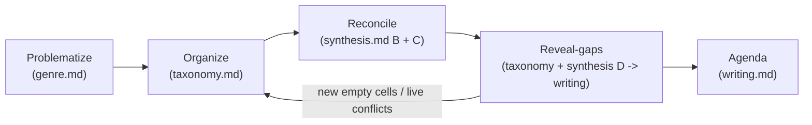

# Genre — when an SoK is the right output, what reviewers reward, and the macro-skeleton

> Scope: **Step 0** of every SoK — deciding whether SoK is even the right genre, framing the
> contribution the way reviewers reward, and the macro-skeleton (Problematize → Organize →
> Reconcile → Reveal-gaps → Agenda) that routes each move to the file that owns its machinery.
> This file OWNS the macro-skeleton, the genre-fit gate, and the **Problematize** obligation; it
> does NOT duplicate the reconciliation/grading/boundary machinery the routed files own.

## 1. What an SoK is, and its provenance

A survey/SLR answers **"what exists?"**; an SoK answers **"what does the field now KNOW, and what is
its structure?"** That is the single load-bearing distinction. The deliverable is the
**systematization contribution — not coverage**: an SoK is accepted on its *treatment of existing
work*, never on completeness of citation or on new results.

> **IEEE S&P (Oakland) SoK acceptance criteria — verbatim** (CfP, `sp2026.ieee-security.org/cfpapers.html`,
> accessed 2026-06-18): SoKs are judged on "their treatment of existing work and value to the
> community, **and not based on any new research results they may contain**." And: "Survey papers
> without such insights are not appropriate and **may be rejected without full review**."

**Genre history.** The SoK track began in **2010 at IEEE S&P**, seeded by the **Nov 2008 Claremont
Workshop on the Science of Security** (NSF/IARPA/NSA). It spread to **EuroS&P (2017)**, **PETS
(2019)**, **SaTML (2023)**, **USENIX Security (2024)**, and **NDSS (2026)** — all dated from the
canonical meta-resource `oaklandsok.github.io` (accessed 2026-06-18).

> **Founding motivation — Oakland SoK FAQ, verbatim** (`oakland31.cs.virginia.edu/sokfaq.html`,
> accessed 2026-06-18): the community "seems to lose memory of things that have been done in the
> past and produces too many incremental results that don't always lead to better general
> understanding." This is the primary-source warrant for the **Problematize** move (§4).

**The venue economy.** IEEE S&P accepts roughly **7–13 SoKs per year** (`oaklandsok.github.io`
index: **7 in 2022, 8 in 2023, 13 in 2024, 12 in 2025, 6 in 2026-so-far**), each reviewed by the
**full PC at the same bar as research papers**, with **no guaranteed slots**. The bar is the
**systematization contribution**, not slot scarcity: a "merely complete" survey is rejected on
*treatment of existing work*, not crowded out. (USENIX Security '26 CfP confirms the second-venue
bar — verbatim: SoKs "go beyond simply summarizing previous research… they also include a thorough
examination and analysis of existing approaches, identify gaps and limitations, and offer insights
or new perspectives on a given, major research area"; `usenix.org/conference/usenixsecurity26/call-for-papers`,
accessed 2026-06-18.)

## 2. The three admissible SoK contribution types

An SoK must deliver **at least one** of these. If you cannot name which one, you do not yet have an
SoK — you have a survey draft. The wording is the IEEE S&P CfP's, verbatim; each type gets a
**distinct, correctly-matched** exemplar.

| Contribution type (CfP verbatim) | What it must deliver | Exemplar |
|---|---|---|
| (a) "an important **new viewpoint** on an established, major research area" | A reframing that changes how the community organizes/judges the area | *SoK: Eternal War in Memory* (Oakland 2013) — reframes memory-safety defenses around an attacker-vs-defender model |
| (b) "**support or challenge long-held beliefs**… with compelling evidence" | Evidence that confirms or overturns a community-wide assumption | Schaeffer et al., *Are Emergent Abilities a Mirage?* (NeurIPS 2023, arXiv:2304.15004) — challenges the "emergent abilities" belief, showing sharpness is a metric artifact (`synthesis.md` Part E) |
| (c) "a convincing, comprehensive **new taxonomy** of such an area" | A classification a reader can place a *new, unseen* work into and read off its properties | the prompt/agentic-AI security SoK (arXiv:2510.15476) — a holistic multi-level taxonomy + standardized, auditable comparison matrix |

Note: SoKs are now common in ML-security venues (SaTML, USENIX) — arXiv:2510.15476 is a cs.CR/cs.AI
SoK, so the genre is established adjacent to AI4S, not (on this evidence) inside it. For an AI4S
audience, the type-(b) Schaeffer exemplar is the live bridge.

**Submission mechanics are venue- and year-specific — re-check the target CfP.** For **IEEE S&P
2026/2027**: title carries the **`SoK:` prefix**, submission requires the SoK **checkbox**, and
**references do not count toward the page limit** ("For SOK papers, the references do not count
towards the number of pages"). USENIX/NDSS/PETS differ; confirm against the venue's current CfP
before relying on any of these. Corpus-construction machinery for any type lives in `workflow.md`;
the taxonomy machinery for (c) lives in `taxonomy.md`.

## 3. THE GENRE-FIT GATE (run at Step 0, before framing the question)

The skill **MUST say so** when SoK is the wrong genre rather than forcing the structure. Run this
decision table first. Each row states the **consequence-and-flip** — no bare "unverified"/"未検証".

| Topic state | Right output | Why (and the flip) |
|---|---|---|
| **Established major area** with accumulated, **partly-conflicting** work | **SoK** | There is something to systematize *and* contradictions to reconcile — the reconciliation engine has fuel. |
| **Nascent area**, too little to organize | **position / vision paper** *(out of this skill's scope)* | Nothing to systematize yet → forcing SoK yields coverage theater. *Flip:* if the area matures and conflicting results accumulate, re-run this gate. |
| **Narrow single question** | **targeted SLR** (Kitchenham) | One focused question needs depth, not a taxonomy. *Flip:* if it broadens into a major area with rival approaches, escalate to SoK. |
| **Broad landscape** with **little conflict** | **systematic mapping study** (PRISMA-ScR) | Map breadth/gaps when there is no contradiction to reconcile. *Flip:* once the map exposes conflicting clusters, the reconciliation makes it an SoK. |

The conflicting-work test is the pivot. The SLR / mapping branches **share `workflow.md`'s
PRISMA/Kitchenham search-and-screen machinery** (it is scoped to the SoK path but the protocol
transfers); **position / vision papers are out of this skill's scope**. Commit to SoK only when an
admissible contribution type (§2) is already visible.

**Gate-output template** (emit this verbatim when the gate fails, mirroring the GAP template in
`writing.md`):

> `GATE VERDICT: not-SoK → <position paper | targeted SLR | mapping study>; reason: <which §3 row>; flip: <condition under which to re-run the gate>.`

## 4. THE FIVE RHETORICAL MOVES — the macro-skeleton

Every top SoK is structured as five moves. This is the spine the agent organizes prose around;
each move's *machinery* lives in another file, so this file does the **routing**, not the work.

| Move | What it does | File(s) that own the machinery |
|---|---|---|
| **Problematize** | Destabilize a long-held belief, or name the fragmentation (the field "loses memory… too many incremental results that don't always lead to better general understanding" — the FAQ warrant, §1) | **`genre.md`** (this file) |
| **Organize** | Impose a **Nickerson 2013** taxonomy surfacing *dependency / inclusion / variation* among designs — **not** a flat list | `taxonomy.md` |
| **Reconcile** | Resolve **every** contradiction via its moderator (never "the literature is mixed"); grade the resolved claim | `synthesis.md` Part B (moderator search) + Part C (certainty) |
| **Reveal-gaps** | Show what the organized + reconciled map makes visible that **no single paper** could | generated in `taxonomy.md` (empty-cell mining) + `synthesis.md` Parts B/D (unreconciled-conflict & boundary gaps); narrated/scored in `writing.md` |
| **Agenda** | Each open question = **why-it-matters + the blocking obstacle** (never "future work") | `writing.md` |

The diagram earns its place by showing what the table cannot: the **loop-back** from Reveal-gaps to
Organize (newly exposed empty cells and live conflicts re-enter the taxonomy), the routing of each
move to its owning file as edges.

**Problematize is owned here** because it is a genre obligation, not a method: a top SoK *opens* by
destabilizing a belief or naming the fragmentation, never with "here is a list." The other four
moves are pointers — do not restate Nickerson, GRADE, the moderator search, or gap-scoring in this
file. **Seam with `workflow.md`:** `genre.md` owns the GENRE OBLIGATION to open by problematizing
(the rhetorical move + the 2008/2010 warrant); `workflow.md` owns OPERATIONALIZING it into the
frozen known-vs-unknown question (Step 1). The destabilizing opening paragraph is *drafted from*
`workflow.md`'s frozen question but must *satisfy* `genre.md`'s Problematize obligation — neither
file re-derives the other. (Corpus construction precedes Problematize: `workflow.md`.)

## 5. Preserve the good bones — the legacy /SOK prompt maps 1:1

The legacy 34-line `/SOK` prompt already had the right skeleton; this file is the **bridge** showing
continuity, not replacement. Each legacy "bone" is one of the five moves (or a downstream mechanic).
Pure routing — bone → move → owning file, no restatement of the mechanic:

| Legacy /SOK bone | Move | Owning file |
|---|---|---|
| Research Question (known vs unknown) | precedes Problematize | `workflow.md` |
| Relation map (confirm/extend/contradict/condition) | Organize → Reconcile | `synthesis.md` Part B |
| Unified claims | Reconcile | `synthesis.md` Part C |
| Boundary conditions | Reconcile / Reveal-gaps | `synthesis.md` Part D |
| Theoretical integration | Reconcile | `synthesis.md` Part E |
| Open questions | Agenda | `writing.md` |
| Prohibitions | invariants + anti-pattern quick list | `SKILL.md` |

The bones are sound; the depth below them (Nickerson, GRADE, moderator search, AI4S gates) is what
this skill adds.

## Anti-patterns — genre-stage additions only (full quick list in `SKILL.md`)

These two are *original to the genre stage*; the rest (coverage theater, vote-counting,
contradiction-laundering, etc.) live in `SKILL.md`'s non-negotiable invariants + anti-pattern quick
list.

| Anti-pattern | Why wrong | Fix |
|---|---|---|
| **Genre miscast** | Forcing SoK structure onto a nascent or narrow topic | Run the genre-fit gate (§3): nascent → position paper; narrow → targeted SLR — and emit the GATE VERDICT |
| **No problematization** | Opening with "here is a list" instead of destabilizing a belief or naming the fragmentation | Lead with the **Problematize** move (§4); the FAQ "lose memory" warrant is your opening |
