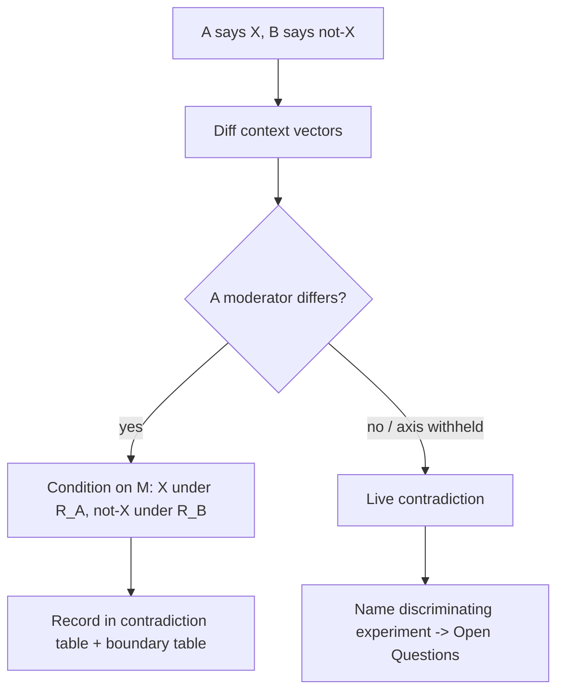
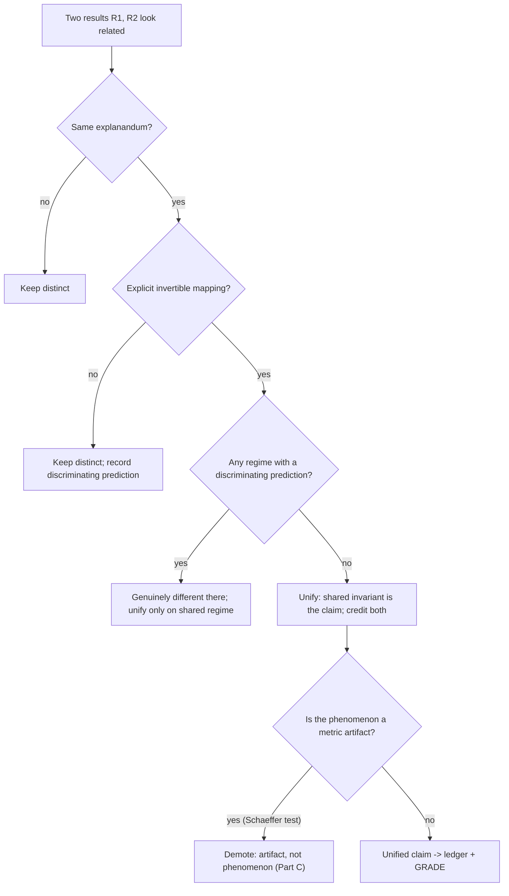

# Synthesis — the reconciliation engine: weigh, reconcile, grade, bound, unify

> Scope: the whole adjudication core — combine without vote-counting, reconcile every contradiction by its moderator, GRADE each claim, bound it with a flip condition, unify only after a formal sameness test.

**This file CONSOLIDATES** the four former standalone references — the moderator search, GRADE, the boundary/flip-condition protocol, and the unification sameness test — into one file. These five tasks (weigh · reconcile · grade · bound · unify) share the context vector and ping-pong constantly, so they live here as Parts A–E (A weigh · B reconcile · C grade · D bound · E unify); SKILL.md and all cross-refs point to `synthesis.md` Parts A–E. **Admissibility precedence: which numbers may enter synthesis at all is gated upstream by `ai4s-gates.md`; a number that fails its gate is quarantined there, never graded here.** This file's synthesis-scoped anti-pattern table (closing section) is the catalog for Parts A–E; per-topic catalogs live distributed across each reference file's own table (no standalone anti-patterns file).

| comes from | this file produces | goes to |
|---|---|---|
| per-claim source + context vector (`ledger.md`); taxonomy dimension axes (`taxonomy.md`) as pre-vetted moderator candidates | contradiction table + boundary table + graded, regime-indexed unified claims | gap scoring + the document (`writing.md`) |

## Part A — No vote-counting: weigh, don't count

Counting how many papers report an effect (or report significance) and going with the majority is
**vote-counting**, a discredited synthesis method (Borenstein, Hedges, Higgins & Rothstein 2009;
Cochrane Handbook v6, Ch. 12 *Synthesis without meta-analysis*, McKenzie & Brennan — the
prohibition is the long-standing §9.4.11 of earlier editions). It is banned as a justification in
an SoK.

| Why it fails | Consequence |
|---|---|
| **Ignores study size/power** | 10 tiny underpowered "no effect" studies lose to 1 large positive study; vote-counting inverts the truth |
| **Ignores effect size** | A direction tally discards magnitude — the only thing a researcher can act on |
| **Statistical-power paradox** | When per-study power is *low* (roughly below 0.5; the exact crossover depends on effect size and α), adding more small studies drives the probability of the correct majority verdict *toward zero* instead of up (Hedges & Olkin 1980) |
| **Non-independence** | Shared authors/data/benchmark/codebase make "5 papers" effectively 1; the count is inflated |
| **Publication/selection bias** | The corpus is the surviving subset; counting survivors measures the filter, not the world |
| **p-value ≠ evidence weight** | Tallying "significant" results conflates significance with importance and with truth |

**Replace counting with weighting.** Weight each result by: study **design** (RCT/ablation >
observational > anecdote), **sample/scale** (params, tokens, n), **effect size + precision** (CI
width), **independence** (the `independence` ledger column), and **risk of bias** (leakage,
undisclosed split — `ledger.md`, Part C). The output is a *weighted* position, auditable from the
ledger.

**Independence — collapse before you weigh.** Before any weighting or pooling, collapse
non-independent results (the `independence` ledger column): same dataset reused, same authors'
follow-up, same leaderboard, shared pretrained checkpoint. Treat a cluster as one weighted unit.
This single step kills the most common inflation of apparent consensus.

### Narrative vs quantitative (meta-analytic) synthesis — pick deliberately

| | Narrative / structured | Quantitative / meta-analytic |
|---|---|---|
| **Use when** | Effects not commensurable (different metrics/tasks/outcomes); few studies; heterogeneous designs | Effects share a common, convertible scale; ≥ a handful of comparable estimates |
| **Produce** | A reasoned argument organized by claim/dimension, weights stated qualitatively | A pooled effect (random-effects) + a heterogeneity statistic + forest-plot-style view |
| **Failure mode** | Slides into vote-counting if undisciplined | False precision: pooling apples and oranges |
| **CS/ML reality** | Most SoKs land here — benchmarks rarely commensurable | Possible within one benchmark family / one metric (pooled Δaccuracy across seeds) |

When narrative, **rank** evidence by the weighting axes and say so: a **disciplined narrative
synthesis** (Popay et al. 2006 for the *conduct* — group by claim, tabulate direction + magnitude +
quality, then reason) **reported per the SWiM guideline** (Campbell et al. 2020, BMJ — the
*reporting* standard for synthesis-without-meta-analysis) is the rigorous form.

### Effect-size thinking and heterogeneity — direction is not enough

Report **magnitude with uncertainty**, not sign/significance. Convert to a common effect metric
where possible (Cohen's d, log odds/risk ratio, correlation r, or a domain-native Δaccuracy, Δloss,
R² of a scaling fit); always pair the point estimate with a CI/SE. A wide CI crossing the null is
*Low-certainty* even if "positive."

When comparable estimates disagree, **measure** the disagreement before narrating it:

- **Q (Cochran's)** — test for any heterogeneity (underpowered with few studies).
- **I²** — % of variance from real heterogeneity vs chance (~25% low, ~50% moderate, ~75% high;
  Higgins et al. 2003 — guideposts, not thresholds).
- **τ²** — the between-study variance itself (the spread of true effects).

**High heterogeneity is a signal, not a nuisance:** a **moderator** is hiding in the context
vectors. Do NOT average it away — hand it to Part B (subgroup analysis / meta-regression on the
context axes). Pooling across high I² produces a number that describes no actual setting.

> **Commensurability caveat (do not force a pooled statistic).** I²/τ² are defined only for
> commensurable effects. A top-science corpus often spans incommensurable metrics (accuracy vs
> perplexity vs F1 vs domain scores) where a pooled I² is undefined; computing one is a category
> error. If effects are NOT commensurable, **declare narrative synthesis and state WHY pooling is
> invalid** rather than manufacturing a meaningless number.

## Part B — Never ignore a contradiction: locate the moderator

A "contradict" is never a terminal state; it is the *entry point* to reconciliation, not an excuse
to report "the literature is mixed."

### Step 0 — classify every source pair (the confirm/extend/contradict/condition matrix)

| Relation | Meaning | Action |
|---|---|---|
| **Confirm** | Same claim, independent-ish corroboration | Attach as another `source` on the same cid; weigh (don't count) — Part A |
| **Extend** | B generalizes/specializes A (broader regime, new axis) | Merge into a regime-indexed claim; record the added axis |
| **Contradict** | B asserts ¬A under *apparently* the same context | **Enter the moderator search below — mandatory** |
| **Condition** | B holds A only under a sub-regime | Half-reconciled: name the condition, fold into the boundary table (Part D) |

### Step 1 — diff the context vectors

Contradiction is usually **apparent**: the two claims hold in different regimes the papers did not
foreground. Diff the context vectors (`ledger.md`) along the canonical axes below. **Test the
`taxonomy.md` dimensions first** — a comparison-matrix axis is a *pre-vetted moderator candidate*,
since the taxonomy already isolated the axes along which the field's objects differ, so the
moderator that resolves a contradiction is almost always one of them.

| Moderator axis | "It reverses because they measured…" |
|---|---|
| **Metric / measure** | nonlinear/thresholded vs linear/continuous; exact-match vs partial credit; AUC vs calibration. *The Schaeffer 2304.15004 emergence case lives here — Part E.* |
| **Scale** | model/data/compute regime; effect only above/below a scale; fit at typical vs extreme token/param ratios (the Kaplan↔Chinchilla coefficient case — Part E) |
| **Setting / task** | in-distribution vs OOD; benchmark vs deployment; synthetic vs real data |
| **Population / data** | domain, language, cohort; train/test split discipline (leakage flips many ML4science "wins" — Kapoor & Narayanan 2207.07048) |
| **Method-family** | architecture, optimizer, hyperparameter regime; estimator choice |
| **Analysis choice** | covariate set, exclusion rule, significance threshold (researcher-DoF / garden of forking paths, Gelman & Loken 2013) |

The first moderator that, when conditioned on, makes both results simultaneously true is the
resolution. State it as a falsifiable prediction: "X holds when M ∈ R_A; ¬X when M ∈ R_B."

### Step 2 — the contradiction table (the deliverable)

| pair | claim A (cid) | claim B (cid) | apparent conflict | moderator M | resolved statement | residual |
|---|---|---|---|---|---|---|
| P-03 | C-014 emergence sharp | C-021 emergence smooth | "does ability emerge sharply?" | **metric** (exact-match vs continuous) | sharpness is a metric artifact; under continuous metrics improvement is smooth+predictable | does any task emerge under a *continuous* metric? (live) |
| P-07 | C-031 ML≫LR | C-033 ML≈LR | "is complex ML better?" | **leakage** (train/test split) | with leak-free splits ML≈LR; the gap was data leakage | re-run remaining fields |

Every contradiction appears here. An empty "moderator" cell is allowed only if "residual" names the
**discriminating experiment** (Step 3).

### Step 3 — genuinely live contradictions

When no moderator in the available context resolves it (often because a paper withheld an axis →
`???` in the ledger), the conflict is **live**:

1. State it *as* unresolved (never hide it or average it away — that is contradiction-laundering).
2. Name the **discriminating experiment**: the single comparison whose outcome would decide it
   (same data, same metric, varying only the suspected moderator).
3. Carry it to Open Questions with *why it matters* + *the obstacle* (`writing.md`).

A live contradiction surfaced with its decisive test is a *contribution*; a buried one is misconduct.

## Part C — Grade every claim (GRADE)

GRADE grades the **body of evidence for a specific claim**, not a paper (Guyatt et al. 2008; GRADE
Handbook), adapted from clinical evidence to CS/ML/AI4S. The label answers: how much should we trust
that the true effect is close to the stated one? **Grade per (claim × verified regime), not per
cid:** once Part B locates a moderator you split into regime-indexed claims and grade each
separately (see the Inconsistency rule below).

| Level | Meaning | Wording in the SoK |
|---|---|---|
| **High** | Very confident; further study unlikely to change the estimate | "established", "X holds" |
| **Moderate** | Likely close, but further study *could* shift it | "X likely holds; estimate may move" |
| **Low** | Limited confidence; true effect may differ substantially | "preliminary evidence suggests X" |
| **Very-low** | Little confidence; estimate is uncertain | "X is conjectural / weakly supported" |

**Starting point:** a body of **experimental/controlled** evidence (RCTs; clean ablations /
controlled scaling sweeps with held-out test sets) **starts High**; **observational** evidence
(leaderboards, post-hoc comparisons, correlational field studies) **starts Low**. Then move it.

| Downgrade factor | Down a level when… | CS/ML manifestation |
|---|---|---|
| **Risk of bias** | design/conduct flaws | **data leakage / undisclosed split** (Kapoor & Narayanan 2207.07048 — 8 leakage types); tuning on test; missing REFORMS items; metric chosen post-hoc |
| **Inconsistency** | unexplained heterogeneity | high I²/τ² with no located moderator (Part A/B); no replication across seeds/datasets |
| **Indirectness** | evidence is about a different population/intervention/outcome | benchmark→deployment gap; proxy metric ≠ target; one family generalized to "LLMs" |
| **Imprecision** | wide CI / few samples / few seeds | **single-seed is the canonical trigger**; CI crosses null; too few models to fit a scaling law |
| **Publication bias** | corpus is a filtered survivor set | leaderboard SOTA-chasing; unpublished negatives; funnel-plot asymmetry |

**Each serious concern = −1 level, very serious = −2, applied to the starting level** — that single
rule, not a table of magic constants, sets the grade. *Worked arithmetic:* an observational body
(start Low) with a single serious imprecision concern (single-seed, −1) lands at **Very-low**; an
experimental body (start High) at single-seed lands at Moderate; a leakage-suspect performance claim
is **Low/Very-low regardless of how many papers report it** — exactly why vote-counting fails (Part
A). A partial AI4S gate failure (`ai4s-gates.md`) is just another fired factor: an unchecked leakage
type → −1 risk-of-bias; an unequal-FLOP efficiency claim → very-serious risk-of-bias (−2).

**Upgrade factors apply ONLY to an observational body with no remaining serious downgrade concern**
(GRADE never upgrades a body whose risk-of-bias / inconsistency / imprecision is unresolved):

| Upgrade factor | Up a level when… |
|---|---|
| **Large effect** | effect is large and hard to explain by bias (order-of-magnitude, robust across families) |
| **Dose-response** | monotone gradient — a clean power-law scaling fit across many scales is the AI4S form |
| **Confounders work against** | plausible biases would *shrink* the effect, yet it persists |
| **Independent convergent derivation** (AI4S addition) | ≥2 mechanistically-independent derivations yield the *same* invariant and pass the Part E sameness test — credit by independent mechanism, **not** by repeated report (Part A) |

If Part B **located the moderator**, do NOT downgrade for inconsistency — split into regime-indexed
claims, each graded separately (e.g. "High under continuous metrics; the sharp-emergence claim is
Very-low"). **Output rubric — one line per (claim × verified regime), reconstructable from the
line:**

`C-014 | <claim> | regime: continuous-metric, GPT-3 family | GRADE: Low | start Low (observational); downgrades none; +1 large-effect; −1 metric-artifact risk-of-bias (Schaeffer) ⇒ Low`

## Part D — Bound it: verified regime + flip condition (never stop at "unverified")

"Not yet tested" describes *your corpus*, not *the world*, and is useless to a researcher deciding
what to do. **Every gap statement carries two things the bare verdict omits:** the **consequence**
(what is at stake if the untested region behaves differently) and the **flip condition** (the
specific regime under which the conclusion reverses). "未検証 / unverified" as a terminal verdict is
forbidden.

| Forbidden (terminal) | Required (consequence + flip) |
|---|---|
| "Behavior at >100B params is unverified." | "Verified to 70B (smooth scaling). **If** curvature appears >100B, the compute-optimal ratio claim **reverses** and inference-aware sizing (Sardana 2401.00448) becomes wrong — budget a probe run before committing." |
| "OOD robustness was not evaluated." | "Holds in-distribution. **Under** covariate shift the ranking can **invert** (indirectness, Part C); the claim does not license deployment until a shift test runs." |
| "Only English was tested." | "Established for English. **For** morphologically-rich languages the tokenizer changes the scaling constant, so the token-count claim may **not transfer** — re-fit per language." |

Partition the claim's input space along the context-vector axes into a **verified regime** (the
region actually covered — state the bounds) and an **unverified regime** (everything else, *each
part annotated with its flip condition*). A claim with a large unverified region and no flip
analysis is an **unconditional generalization**.

| cid | claim | verified regime | flip condition (reverses to ¬C when…) | consequence | GRADE |
|---|---|---|---|---|---|
| C-014 | smooth, predictable capability scaling | tested scales × continuous metric, GPT-3 family | a *continuous* metric still shows a sharp jump (Schaeffer residual) | emergence-as-fundamental back on the table | Moderate |
| C-031 | ML ≈ LR for civil-war prediction | leak-free splits, the audited fields | a leak-free study shows a robust ML gap | restores the "ML wins" claim | Low |

**How to find flip conditions:** (1) **invert each GRADE downgrade factor** — the thing that
*lowers* certainty is usually the axis along which the claim *flips* (leakage-suspect → flips when
split is fixed; imprecision → flips when n grows; indirectness → flips OOD); (2) **take the
moderator from Part B** and push it past the tested range; (3) ask which assumption (i.i.d.,
stationarity, same tokenizer, same scale-regime) the verified region relies on — its violation is a
flip condition. Open Questions are flip conditions that *matter and are blocked* (`writing.md`).

## Part E — Unify only after a formal sameness test

Surface resemblance ("both power laws", "both mention attention") is **not** sameness. Unify two
results only when ALL hold; otherwise keep them distinct:

1. **Same explanandum** — they predict/explain the *same observable*, not merely related ones.
2. **Formal mapping exists** — an explicit change-of-variables / reparameterization carries one's
   functional form onto the other's, every symbol mapped (not hand-waved).
3. **Mapping is invertible & non-degenerate** — a genuine isomorphism over the shared regime, not a
   special case collapsing one to a point.
4. **Shared invariant** — the quantity conserved under the mapping is the unified claim's content
   (the exponent, the conserved ratio).
5. **No residual** — if a discriminating prediction distinguishes them in *some* regime, they are
   NOT the same; that regime is where they're genuinely different.

Failing #2 → **false unification** (merging by analogy). Failing to *attempt* the mapping when it
exists → **false distinction** (one phenomenon's two notations reported as two findings, inflating
apparent disagreement and corpus size — feeds vote-counting).

**Worked case A — Kaplan vs Chinchilla (same physics, different fit regime).** Kaplan et al.
2001.08361 and Hoffmann et al. 2203.15556 (Chinchilla) gave *different* compute-optimal
token-to-parameter prescriptions. Same explanandum (loss vs compute): yes. The divergence traces to
**fitting choices** — not different laws. **Concrete discriminator** (so this is checkable, not a
name-drop): check whether the two laws used the **same LR-schedule and token-count accounting** and
the **same compute-optimal vs fixed-model fitting procedure**, fit over the **same range of model
sizes**. If NOT, the disagreement is **bookkeeping, not physics** (cf. Pearce & Song 2406.12907, the
convention-level resolution). Sardana et al. 2401.00448 (*Beyond Chinchilla-Optimal*) shows fitting
only at *typical* token/param ratios
overestimates the marginal value of tokens at extreme ratios, and re-fits across 47 models out to
~10,000 tokens/param. **Verdict:** same phenomenon, **moderator = fitting regime** (Part B); unify
the *form* (power law in N, D), keep the *coefficients* regime-indexed, grade the extrapolation as
Low/Moderate (Part C) with the flip "coefficients re-fit at extreme ratios change the prescription"
(Part D). Template for *every* scaling-law reconciliation.

**Worked case B — emergence as a metric artifact (Schaeffer).** Wei et al. 2022 (arXiv:2206.07682)
report sharp, unpredictable emergent abilities. Schaeffer, Miranda & Koyejo 2023 (*Are Emergent
Abilities a Mirage?*, arXiv:2304.15004) show the sharpness is produced by **nonlinear/discontinuous
metrics** (exact-match, multi-token accuracy); under **linear/continuous metrics** the same outputs
improve smoothly, and they reproduce "emergence" at will by metric choice. This is not unification —
it is the discovery that a reported phenomenon (sharpness) is an **artifact of the measure**
(moderator = **metric**, Part B). Demote the "fundamental sharp emergence" claim's GRADE
(metric-artifact risk of bias, Part C); state the boundary "under a continuous metric, sharpness
disappears" (Part D); keep as a *live residual* whether any task is sharp under a genuinely
continuous metric. Generalize: **before unifying or trusting any "phenomenon," verify it is not an
artifact of a nonlinear/thresholded metric** — re-test under a continuous one.

**Worked case C — convergent theory, multiple derivations (genuine unification).** When two papers
derive the *same* scaling exponent from different first principles (e.g. Brill 2412.07942 grounds
neural scaling in data-distribution percolation and maps its two criticality regimes onto
previously-proposed theories), the sameness test can **pass**: same explanandum, explicit regime
mapping, shared invariant (the exponent). Unify and **credit both derivations as independent
MECHANISMS**. This is exactly the **independent convergent derivation** upgrade factor (Part C,
observational bodies only): ≥2 mechanistically-independent derivations of one invariant earn **+1 via
convergence, not counting** — repeated *reports* of one mechanism earn nothing (Part A).

If the test fails, keep both claims and record the **discriminating prediction** — the observable on
which they disagree. That prediction becomes a boundary flip condition (Part D) and, if untested, an
Open Question with why-it-matters + obstacle. Two genuinely-different theories held distinct with
their decisive test stated beats a premature grand unification that hides the test.

## Anti-patterns (synthesis-scoped) — name the failure AND the fix

This is the catalog for Parts A–E; there is no standalone anti-patterns file (retired — each
reference file carries its own table). The live decision rules are Parts A–E above.

| Anti-pattern | Why wrong | Fix |
|---|---|---|
| **Vote-counting** | "N papers say X" ignores power, effect size, independence; can invert truth (Hedges & Olkin 1980) | Weight by design/scale/effect-size/independence; report effect sizes + heterogeneity (Part A) |
| **Double-counting** | Shared authors/data/benchmark counted as independent | Collapse to one unit via the `independence` ledger column (Part A, `ledger.md`) |
| **Significance-as-evidence** | Tallying "p<0.05" conflates significance with importance and truth | Report magnitude + CI; grade with GRADE (Part C) |
| **Average-across-everything** | Pooling over high heterogeneity describes no real regime | Measure I²/τ², then locate the moderator (Part A/B) |
| **Forced pooled I²** | Computing heterogeneity over incommensurable metrics | Declare narrative synthesis; state why pooling is invalid (Part A caveat) |
| **Contradiction-laundering** | Dropping/footnoting the inconvenient result | Surface it; locate the moderator or flag it live with a discriminating test (Part B) |
| **"The literature is mixed"** | A non-answer that abdicates the SoK's core job | Give the moderator (X under R_A, ¬X under R_B) or the discriminating experiment (Part B) |
| **Outlier deletion** | The dissenter is often where the boundary lives | Treat outliers as moderator candidates, not noise (Part B) |
| **Ungraded certainty** | All claims stated with equal confidence | Apply GRADE; separate High from Low/Very-low in the wording (Part C) |
| **Benchmark→world leap** | One benchmark generalized to "the field" | Mark as indirect (GRADE indirectness); restrict the regime (Parts C, D) |
| **Naked "unverified"** | Ends at "not yet tested" — useless to a decision-maker | State the consequence + the regime where the conclusion flips (Part D) |
| **Unconditional generalization** | Claim stated with no regime; over-claims beyond evidence | Attach verified regime + flip condition to every claim (Part D) |
| **False unification / false distinction** | Merge or split by surface resemblance | Run the sameness test (formal invertible mapping + shared invariant) first (Part E) |
| **Metric-artifact-as-phenomenon** | A "finding" that is an artifact of a nonlinear/thresholded metric | Re-test under a continuous/linear metric (Schaeffer); demote if it evaporates (Part E, `ai4s-gates.md`) |
| **Premature grand unification** | Forcing a merge that hides a discriminating prediction | Keep distinct; record the decisive test as a boundary flip / open question (Part E, Part D) |
| **Kaplan↔Chinchilla bookkeeping mistaken for physics** | Treating a fitting-regime difference as a real disagreement | Apply the LR-schedule/token-accounting/fitting-procedure discriminator (Part E) |

Provenance/leakage admissibility is gated by `ai4s-gates.md`; structure/narrative/diagram/review are
routed to `structuring-documents`, `/AA`, `/linus` — do not re-implement them here.
