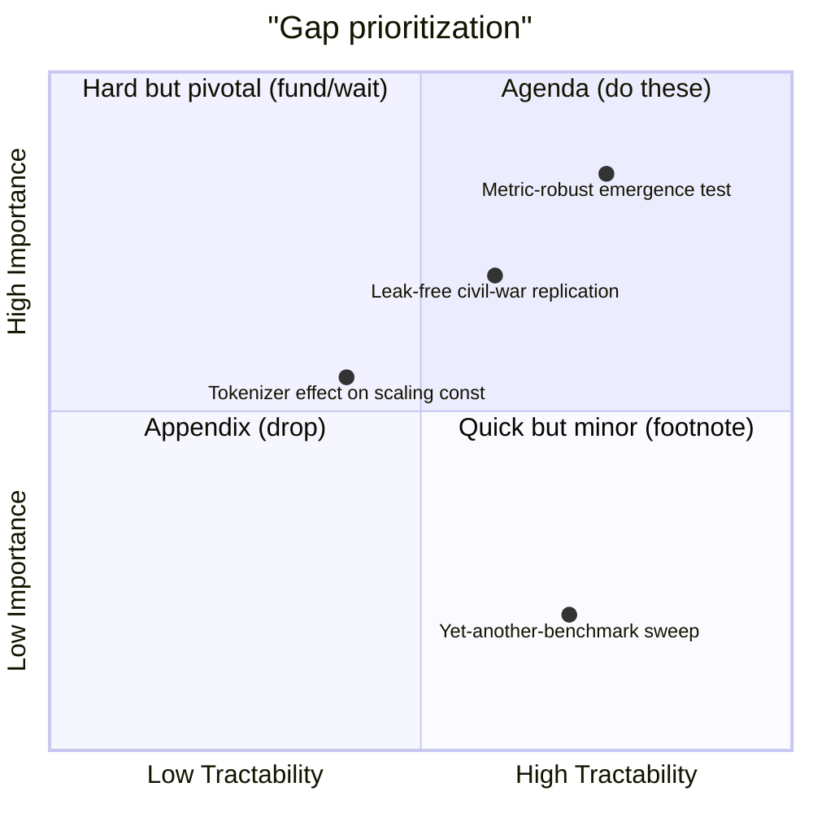

# Writing the SoK — gap analysis, the systematization figure, living-SoK discipline & when to STOP

> Scope: turning the graded, reconciled ledger into the deliverable — gap analysis
> (importance × tractability), the SoK narrative arc, the ONE systematization figure /
> comparison-table-as-hero, living-SoK versioning, and the stop gates. This file owns the
> *deliverable and the agenda*; it **consumes, never re-derives**: the taxonomy (`taxonomy.md`),
> the graded/reconciled claims (`synthesis.md`), the quarantine record (`ai4s-gates.md`). The
> generated SoK document defaults to the user's language (**Japanese**); method/GRADE/ledger
> tokens stay English. Narrative *editing* → `/REORG`; structure → `/MECE`; figure choice →
> `/AA`; ruthless review → `/linus`; versioning/SOT → `grenza-doc-discipline`.

## 1. Gap analysis = the research agenda

The Open-Questions section is the SoK's forward payload, and it is graded by the same bar as the
claims. **Forbidden**: bare "X is unexplored", bare "future work", and any "未検証 / unverified"
terminal verdict (`synthesis.md`, the boundary / flip-condition step). A gap that names neither its
stakes nor its obstacle is a wishlist item, not an agenda item.

**The GAP template** (every open question MUST instantiate it):

```
GAP: <what is unknown>
WHY IT MATTERS: <the consequence for the field if it resolves one way vs the other>
BLOCKING OBSTACLE: <the specific thing — data, method, compute, theory — preventing resolution>
```

This upgrades the legacy prohibition against ending at "unverified": the consequence and the
obstacle are exactly what a bare verdict omits.

**Score every candidate gap on Importance × Tractability** (optionally Neglectedness — the **ITN**
frame, Karnofsky / Open Phil / 80,000 Hours; the importance × tractability pairing is also Hamming,
*You and Your Research*, who never names ITN or Neglectedness). Render on a 2×2 quadrant and route by
quadrant — do NOT collapse the three non-agenda quadrants into one "appendix":

- **Agenda (do these)** = high-importance × high-tractability — the prioritized agenda;
- **Hard but pivotal** = high-importance × low-tractability — flag as **fund / wait**, not dropped;
- **Quick but minor** = low-importance × high-tractability — demote to a **footnote**;
- **Trivial and intractable** = low-importance × low-tractability — **appendix / drop**.



**Gaps come from exactly three sources** — mine all three, do not invent a fourth:

| Source | Where it lives | What the gap statement must add |
|---|---|---|
| **Empty cells** in the morphological box | `taxonomy.md` (faceted box) | distinguish a *genuine open gap* from an *impossible/illegal combination* — and if impossible, say WHY (that justification is itself a contribution) |
| **Live contradictions** | `synthesis.md` (the confirm/extend/contradict/condition relate step + the moderator-reconcile step) | the **single discriminating experiment** that would resolve it — mandatory; "the literature is mixed" is not a gap |
| **Quarantined-but-important claims** | `ai4s-gates.md` quarantine table | the gate it failed (A–F) and the consequence for the field narrative if it were admissible |

For a **live contradiction** the gap MUST name the one discriminating experiment (regime that
yields X vs ¬X). A gap that restates the disagreement without the experiment is a reconciliation
failure leaking into the agenda.

## 2. The SoK narrative arc

The whole document is one argument following the five rhetorical moves (`genre.md`):

| Move | What this section must contain | Sourced from |
|---|---|---|
| **Problematize** | destabilize a long-held belief OR name the field's fragmentation ("incremental results that don't accumulate") | `genre.md` |
| **Organize** | impose the taxonomy that surfaces dependency/inclusion/variation — not a flat list | `taxonomy.md` |
| **Reconcile** | resolve every contradiction via its moderator | `synthesis.md` |
| **Reveal-gaps** | show what the organized + reconciled map makes visible that no single paper could | §1 above |
| **Agenda** | the importance × tractability priorities with why-matters + obstacle | §1 above |

**Topic-sentence discipline**: every paragraph runs **topic-sentence → evidence → implication**.
This file says *what the arc must contain*; `/REORG` owns *how the prose flows* — hand the
editorial pass there, do not re-implement it here.

**The inversion that kills the annotated-bibliography failure mode**: section headings are
**taxonomy dimensions, never paper names**. The unit of organization is one row per **unified
claim** (the legacy unified-claims format, §7), with `cid` / source IDs kept as English tokens;
papers are demoted to evidence pointers. A heading like "Smith et al. (2023)" is the single loudest
signal an SoK has collapsed into a survey.

## 3. The ONE systematization figure

An SoK has **exactly one** central artifact — the taxonomy figure **or** the master comparison
table — from which a reader could reconstruct the entire argument. If a reader who sees only the
figure cannot recover the thesis, the systematization has failed. **Resist a second hero figure**;
competing heroes split the thesis and are an anti-pattern.

The dominant S&P SoK structure makes the comparison table the natural hero: **define desirable
properties → extract generic approaches → evaluate approaches against properties in one table.**

- **Columns = the taxonomy's dimensions** (`taxonomy.md`), plus a small metadata block.
- **Rows = unified claims / systems**, sorted by the most explanatory axis so clusters are
  visually adjacent.
- **Cells cite provenance, not prose restatement**: a closed legend (e.g. `●` full / `◐` partial /
  `○` none / `—` N/A) plus a section/citation anchor, optionally a GRADE tag. A cell with a green
  check and no anchor is claim-laundering.

**Choose the figure type via the `/AA` decision table** and **ALWAYS quote Mermaid node labels**:

| Goal | Artifact |
|---|---|
| taxonomy / classification | tree / mindmap / class diagram |
| positioning along two axes | `quadrantChart` |
| approach-vs-property comparison | **markdown table** (the default SoK hero) |

> **Note**: the matrix *schema* — legend semantics, anchors, MECE-per-dimension, the 5-quality
> gate — is owned by `taxonomy.md`. This file owns only (a) making it the **single thesis-carrying
> artifact** and (b) choosing the rendering. Do not re-specify the schema here.

## 4. Living-SoK versioning + SOT

An SoK of a fast-moving field (LLM scaling) is stale in months; treat it as a living document.

**The claim ledger is the SOT.** README, abstract, changelog, and the PRISMA flow diagram are
**derived** and regenerated from it — never write a fact twice (drift is otherwise guaranteed:
the abstract and the ledger silently diverge).

Adopt grenza's **{yymm}.y.z** scheme, and **every bump names its axis of change**:

| Component | Axis of change | Example trigger |
|---|---|---|
| `yymm` | scope / field redefinition | the SoK's question or inclusion criteria change |
| `y` | narrative change | a new unified claim, a restructured taxonomy, a flipped grade |
| `z` | editorial | wording, figure polish, typo — no claim moved |

**Re-run the pipeline on deltas, not from scratch**: new papers enter the ledger, only the
affected cells/claims/grades update. **State an empty gap analysis EXPLICITLY** — "0 open" is a
checked result; a missing section reads as unchecked.

> **Delegate** the full versioning / staleness / `STATEMENT_REGISTRY` machinery to
> `grenza-doc-discipline`. This is a one-line handoff — do not duplicate that skill's mechanics.

## 5. When to STOP

Two gates, not vibes. The **pre-registered PRISMA scope** (`workflow.md`) is what makes "done"
defensible — without it, "done" is indistinguishable from "tired".

**STOP GATHERING** when new papers add:
- no new taxonomy cells (`taxonomy.md`), AND
- no new moderators (`synthesis.md`),

i.e. Nickerson's ending conditions are reached and the saturation rule in `workflow.md` has fired.
Record the snowball iteration at which it fired; if it never fired, report the corpus as explicitly
incomplete in threats-to-validity.

**STOP WRITING** when ALL hold:
- every ledger claim is **graded** (`synthesis.md`, the GRADE / certainty step);
- every contradiction has a **located moderator** OR an explicit **live-with-discriminating-experiment** flag (`synthesis.md`);
- every empirical number **cleared the AI4S gates A–F or is quarantined** (`ai4s-gates.md`) — none silently dropped;
- the **systematization figure stands alone** (§3);
- the gap analysis is present (even if "0 open");
- the **substance-audit table is complete** — every section passes the expert-surprise test, every
  load-bearing claim fills the resolution grammar, the vague-quantifier grep is clean
  (`resolution.md`) — a document that passes the four gates above but fails this one is
  **scaffold theater**, not done.

Failing the first gate → scope sprawl. Failing the second → shipping ungraded claims / ignored
contradictions. Both are failure modes; the gates convert "done" from a feeling into a checklist.

> **Note**: the canonical **A–F gate lettering** (A leakage … F distribution-shift) is owned by
> `ai4s-gates.md`. This file (and §1's quarantine-source row) is a **consumer** of those letters —
> if the lettering changes, it changes there, not here.

## 6. The adversarial self-review

Before declaring done, run one ruthless pass (this file lists the GATE; **`/linus` owns the
execution**):

- demand the source for **every** claim — "show me the ablation";
- kill **every** ungraded assertion;
- surface **every** ignored contradiction;
- flag **every** "N papers say X" (vote-counting, banned — `synthesis.md`);
- verify the **figure stands alone** (§3);
- check **no claim ends at "未検証"** (§1; `synthesis.md`, the boundary / flip-condition step);
- run the **resolution audit** — expert-surprise test per section, six-slot grammar per
  load-bearing claim, deny-list grep (`resolution.md`): "what does an expert LEARN here?" is the
  question `/linus` should be unable to answer with "nothing".

Run the three passes in order — `/linus` (find the holes) → `/MECE` (relocate scattered facts,
backward-only references) → `/REORG` (topic-sentence narrative).

## 7. Language reminder

The generated SoK **document defaults to the user's language (Japanese)**. Keep these as stable
**English** identifiers even inside Japanese prose — they are technical handles, not translatable
phrases:

- method names: `PRISMA`, `GRADE`, `REFORMS`, `Nickerson`, `Kitchenham`;
- GRADE labels: High / Moderate / Low / Very-low;
- gate labels: A–F (`ai4s-gates.md`);
- ledger tokens: `cid`, `moderator`, `I²`, `τ²`, regime / flip-condition.

Preserve the legacy unified-claims format: `[condition] のとき [主張] が成立 (根拠: A,B,C)`.

## Anti-patterns (writing / gaps / operational)

The general SoK failure catalog (annotated-bibliography, vote-counting, generating-in-English, …)
lives in **SKILL.md's anti-pattern list** — not restated here. This table owns only the
**writing / gaps / operational** anti-patterns that have no home at the higher layer:

| Anti-pattern | Why wrong | Fix |
|---|---|---|
| **Bullet soup / no narrative** | scattered facts, no argument | topic-sentence → evidence → implication; hand to `/REORG` (§2) |
| **Multiple competing hero figures** | splits the thesis; reader can't find the load-bearing artifact | **exactly one**; choose type via `/AA` (§3) |
| **"Future work" dump / "X is unexplored"** | a wishlist with no stakes or obstacle | importance × tractability + the WHY-MATTERS / OBSTACLE template (§1) |
| **Living-SoK drift / version bump with no axis-of-change** | abstract and ledger diverge; bump means nothing | `{yymm}.y.z` with a **named axis**; ledger = SOT; defer to `grenza-doc-discipline` (§4) |
| **Never stopping (scope sprawl)** | corpus grows past saturation, no defensible "done" | STOP-GATHERING gate: no new cells, no new moderators (§5) |
| **Stopping with ungraded claims** | ships a survey wearing an SoK label | STOP-WRITING gate: graded + reconciled + gate-cleared + figure-standalone (§5) |
